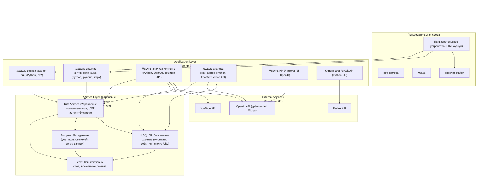

## Архитектура системы

**Application Layer**:
- Модуль Распознавания Лиц (cv2): Анализирует данные с веб-камеры для контроля присутствия пользователя перед экраном.
- Модуль Анализа Активности Мыши (pynput, scipy): Оценивает характер движений мыши для различения реальной и симулированной активности.
- Модуль Анализа Скриншотов (pyautogui): Делает снимки экрана и отправляет их на анализ для определения продуктивности контента.
- Модуль Анализа URL/Заголовков: Оценивает релевантность веб-страниц и видео по их метаданным.
- Модуль ИИ Учитель (Веб-интерфейс + Логика): Реализует интерактивное обучение с ИИ, способным давать задания и оценивать ответы.
- Модуль Поиска Ключевых Слов: Идентифицирует релевантные учебные материалы по ключевым словам.

**Service Layer**:
- Auth Service: Отвечает за аутентификацию и авторизацию пользователей, управление их учетными данными и токенами доступа.
- postgresql – oltp бд. используется для хранения метаданных – структурированной информации, такой как профили пользователей (включая их api-ключи для pavlok и openai, которые должны быть надежно защищены), данные об учебных сессиях, индивидуальные настройки пользователя, списки утвержденных ключевых слов и, возможно, детальные логи отправленных стимулов.
- nosql (mongo/cassandra) – предназначена для хранения сессионных данных и логов – больших объемов менее структурированной информации, такой как события активности (обнаружение лица, движения мыши), результаты анализа скриншотов (метаданные и ссылки), результаты анализа url и контента, а также история диалогов с ии-учителем.
- redis – кеширование

**Внешние Системы**:
- OpenAI API (GPT-4o-mini, Vision): Используется для продвинутого анализа текста, распознавания образов на скриншотах и обеспечения работы ИИ-Учителя.
- YouTube Data API v3: Применяется для получения информации о видео (названия, описания, каналы) и для эффективного поиска по ключевым словам.
- Pavlok API v5: Обеспечивает взаимодействие с браслетом Pavlok для отправки тактильных стимулов (вибрация, звуковой сигнал, электростимуляция).
