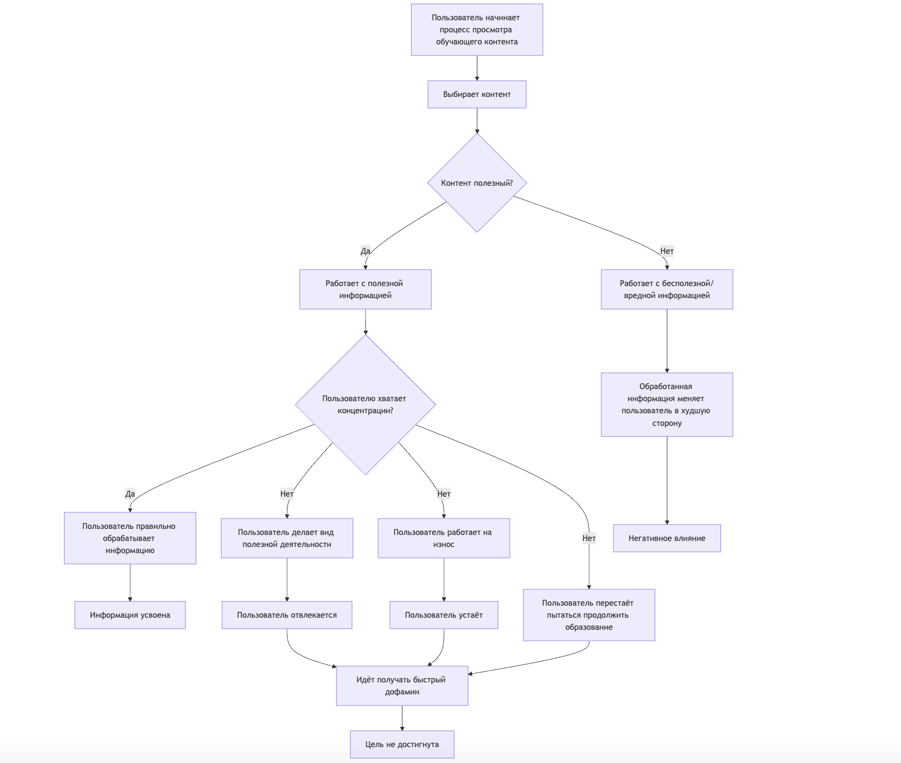
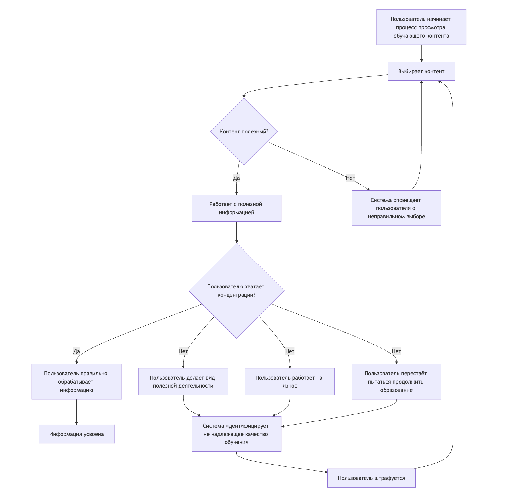

## Трансформация процесса обучения и повышения продуктивности

### До внедрения системы (AS-IS):

- **Субъективность и самоконтроль:** Эффективность обучения целиком и полностью зависит от самодисциплины пользователя, его умения концентрироваться, самостоятельно фильтровать информацию и противостоять отвлекающим факторам. Часто это приводит к низкой продуктивности.
- **Отсутствие немедленной обратной связи:** Пользователь может часами заниматься непродуктивной деятельностью, отвлекаться или работать с бесполезным контентом, не получая своевременных сигналов о необходимости скорректировать свое поведение.
- **Высокая подверженность прокрастинации:** Легкий доступ к развлечениям и источникам "быстрого дофамина" часто прерывает учебный процесс, уводя пользователя от первоначальных целей.
- **Риск выгорания и некачественного обучения:** Работа "на износ" без контроля или потребление вредной/бесполезной информации могут привести к умственной усталости, формированию неверных знаний и общему снижению мотивации.
- **Пассивный и неинформированный выбор контента:** Решение о полезности учебных материалов принимается пользователем интуитивно, без объективной внешней оценки, что увеличивает риск ошибки.

### После внедрения системы (TO-BE):

- **Активная поддержка и объективный контроль:** Система выступает в роли интеллектуального ассистента, помогая пользователю поддерживать концентрацию, предоставляя объективную оценку контента и следя за качеством его вовлеченности.
- **Мгновенная и персонализированная обратная связь:** При обнаружении отвлечения, симуляции активности, работы с нерелевантным контентом или признаков усталости, система немедленно предоставляет обратную связь через уведомления и тактильные стимулы браслета Pavlok, адаптированные под пользователя.
- **Снижение прокрастинации и формирование полезных привычек:** Система условных рефлексов (негативные стимулы при отклонении от продуктивной деятельности и позитивные/нейтральные при следовании ей) помогает снизить тягу к отвлечениям и способствует формированию устойчивых учебных привычек.
- **Предотвращение выгорания и защита от деструктивного контента:** Анализируя активность и контент, система может предупреждать о непродуктивной работе или явно блокировать/сигнализировать о вредных ресурсах, способствуя более здоровому и безопасному обучению.
- **Интеллектуальный анализ и фильтрация контента:** Используя ИИ для анализа названий, URL, скриншотов и ключевых слов, система активно помогает пользователю выбирать действительно полезные учебные материалы и избегать информационного мусора.
- **Новый элемент: ИИ-Учитель с физической обратной связью:** Внедрение интерактивного ИИ-наставника, который не только предоставляет учебный материал и задает вопросы, но и может применять немедленную тактильную обратную связь (поощрение/наказание) через браслет, создает уникальный и потенциально более эффективный и увлекательный опыт обучения.

### Изменение качества и фокуса учебного процесса:

- **Было:** Самостоятельное, часто неструктурированное обучение, где пользователь полагается на собственную силу воли, подвержен частым срывам и неэффективному использованию времени. → **Стало:** Направляемое, контролируемое и интерактивное обучение, где система активно помогает поддерживать фокус, выбирать качественный контент и придерживаться учебных целей.
- **Было:** Реакция на потерю концентрации или неправильный выбор контента происходит с задержкой, если вообще происходит. → **Стало:** Проактивное обнаружение системой проблемных паттернов поведения и немедленная, целенаправленная коррекция.
- **Было:** Полностью субъективная оценка контента и собственного состояния. → **Стало:** Дополнительная объективная оценка со стороны системы, основанная на анализе данных, что помогает принимать более взвешенные решения.
