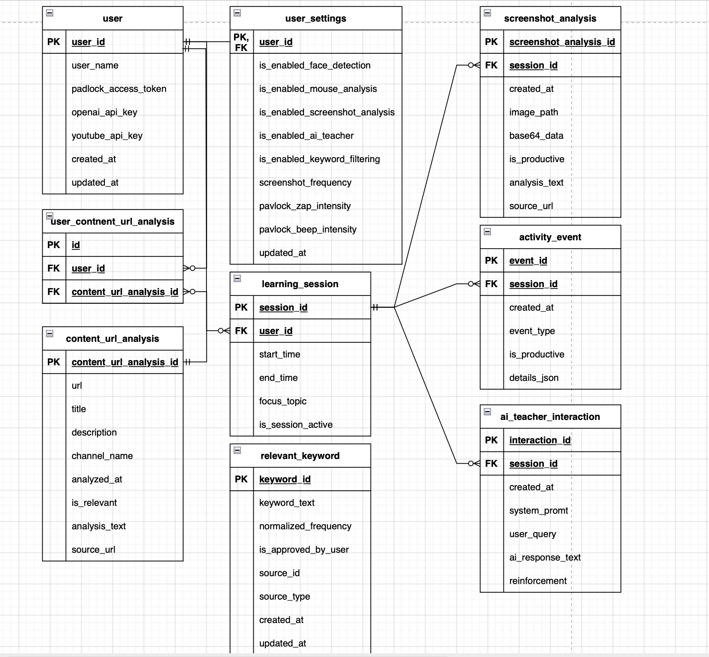

## Струкрута Базы Данных 

**Хранение данных**:
- postgresql – oltp бд. используется для хранения метаданных – структурированной информации, такой как профили пользователей (включая их api-ключи для pavlok и openai, которые должны быть надежно защищены), данные об учебных сессиях, индивидуальные настройки пользователя, списки утвержденных ключевых слов и, возможно, детальные логи отправленных стимулов.
- nosql (mongo/cassandra) – предназначена для хранения сессионных данных и логов – больших объемов менее структурированной информации, такой как события активности (обнаружение лица, движения мыши), результаты анализа скриншотов (метаданные и ссылки), результаты анализа url и контента, а также история диалогов с ии-учителем.
- redis – кеширование
