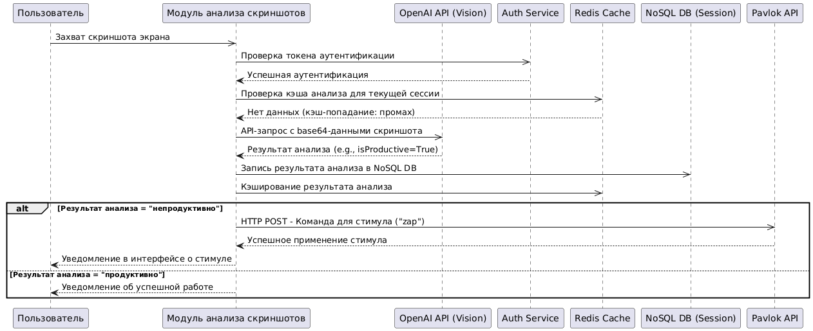

## Поведенческая диаграмма "Анализ скриншота и активности пользователя при отвлечении"

**Сценарий**: Пользователь находится в учебной сессии, но система подозревает отвлечение.

1. Инициация и Настройка: Пользователь уже начал учебную сессию. Клиентское Приложение (Оркестратор) на его устройстве ранее получило от PostgreSQL DB (через Application Logic Service) пользовательские настройки, включая частоту мониторинга и анализа скриншотов.
2. Периодический Мониторинг - Отклонение Обнаружено:
- Модуль Распознавания Лиц периодически проверяет наличие лица пользователя перед экраном. В данном сценарии он фиксирует, что лицо не обнаружено. Эта информация передается в Клиентское Приложение.
- Клиентское Приложение через Application Logic Service (Backend) отправляет событие "NoFace" на сохранение в NoSQL DB (журнал активности).
- Параллельно Модуль Анализа Мыши оценивает текущую активность мыши. Он определяет низкую энтропию движений, что интерпретируется как симуляция активности. Это событие также логируется через Application Logic Service в NoSQL DB.
2. Анализ Скриншота:
- Клиентское Приложение инициирует Модуль Анализа Скриншотов для захвата текущего изображения экрана.
- Модуль делает скриншот. Для безопасного и эффективного хранения, он запрашивает у Application Logic Service PreSigned URL для загрузки файла напрямую в Blob Storage.
- Application Logic Service генерирует и возвращает PreSigned URL, авторизующий временную загрузку в Blob Storage.
- Модуль Анализа Скриншотов загружает файл скриншота в Blob Storage по полученному URL.
- Затем модуль отправляет (например, URL загруженного скриншота из Blob Storage или его base64 представление) в OpenAI API (модель Vision) для анализа на предмет продуктивности отображаемого контента.
- OpenAI API обрабатывает запрос и возвращает результат анализа, например, {текст: "Пользователь смотрит развлекательное видео", reinforcement: false}, указывая на непродуктивный контент.
- Этот результат передается обратно в Клиентское Приложение.
3. Логирование и Принятие Решения:
- Клиентское Приложение через Application Logic Service логирует результаты анализа скриншота (включая флаг непродуктивности и ссылку на изображение в Blob Storage) в NoSQL DB.
- Клиентское Приложение агрегирует все полученные сигналы: отсутствие лица, симуляция активности мыши и непродуктивный контент на скриншоте. На основе внутренней логики система приходит к выводу, что пользователь отвлекся.
4. Применение Стимула:
- Если условия для стимуляции выполнены (например, комбинация негативных факторов превышает порог), Клиентское Приложение отправляет через Pavlok API команду на браслет пользователя для применения негативного стимула (например, "zap" - короткий электрический разряд).
- Pavlok API подтверждает успешную отправку команды.
- Факт отправки стимула (тип, причина, время) также логируется Клиентским Приложением через Application Logic Service (например, в PostgreSQL DB для последующего анализа эффективности стимулов или в NoSQL DB как часть общего лога событий сессии).
Этот сценарий демонстрирует комплексное взаимодействие локальных модулей, облачных сервисов хранения, аналитических API и устройства обратной связи для активного управления вниманием пользователя.
